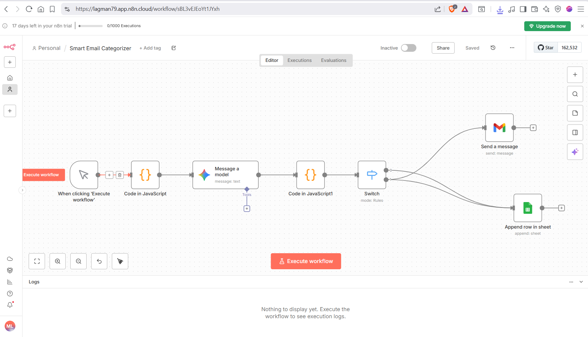
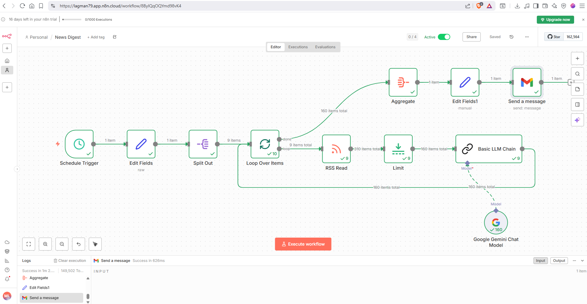

# n8n Workflows

AI-powered workflow automations using n8n.

---

## 1. Smart Email Categorizer

An automated email classification workflow that uses AI to categorize incoming emails and route them based on their content.

### What it does

1. **Receives email data** (subject, body, sender)
2. **AI Analysis** — Gemini analyzes the email and returns:
   - Category (Invoice, Complaint, Sales, Other)
   - Sentiment (Positive, Negative, Neutral)
3. **JSON Parsing** — Cleans AI response and extracts structured data
4. **Smart Routing** — Routes emails based on category:
   - Complaints → Sends notification via Gmail
   - All emails → Logged in Google Sheets

### Problem it solves

Automates email triage for businesses. Instead of manually reading and sorting emails, AI analyzes and routes them automatically — saving time and ensuring faster response to complaints.

### Tech Stack

- n8n, Google Gemini, Gmail API, Google Sheets API

### Trigger

Manual execution with mock data (for testing). Can be replaced with Gmail Trigger for production use.

---

## 2. AI-Powered Daily News Digest

An automated workflow that aggregates news from multiple RSS feeds, filters them using AI to remove noise (gossip, sports, clickbait), generates concise summaries, and delivers a clean HTML digest directly to your email inbox.

### Features

- **Multi-Source Aggregation:** Pulls latest articles from multiple news outlets
- **Smart AI Filtering:** Uses LLM to keep only serious news (Politics, Economy, Society)
- **Auto-Summarization:** Generates 1-paragraph summaries in Greek
- **HTML Formatting:** Clean list with clickable links
- **Rate Limiting:** Processes only latest 20 articles per source

### How It Works

1. **Schedule Trigger** — Runs automatically every morning
2. **RSS Read** — Fetches feed URLs
3. **Limit** — Restricts to latest 20 items per feed
4. **Basic LLM Chain** — AI analyzes, filters, and summarizes
5. **Aggregate** — Collects all items into single list
6. **Gmail** — Sends final HTML digest

### Tech Stack

- n8n, Google Gemini, Gmail API, RSS

### AI Filtering Logic

- **Keep:** Politics, Economy, Society, International, Health, Environment
- **Discard:** Lifestyle, Gossip, Sports, Astrology, Recipes

---

## License

MIT License